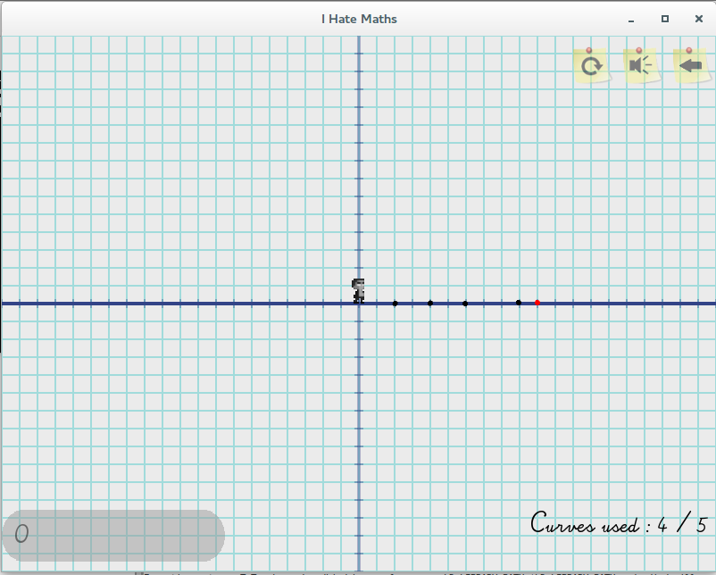
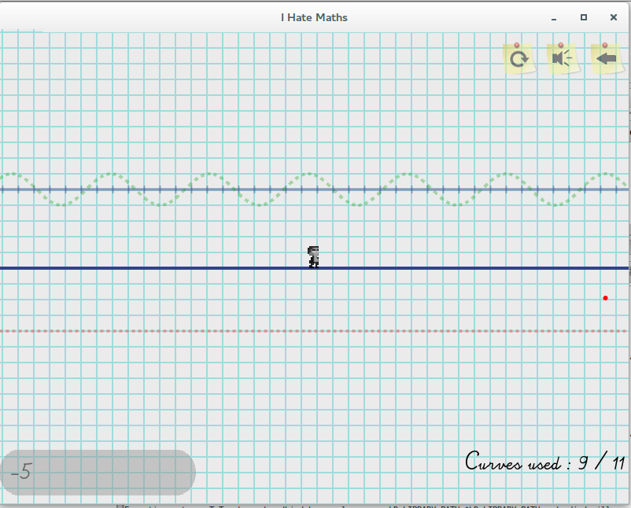
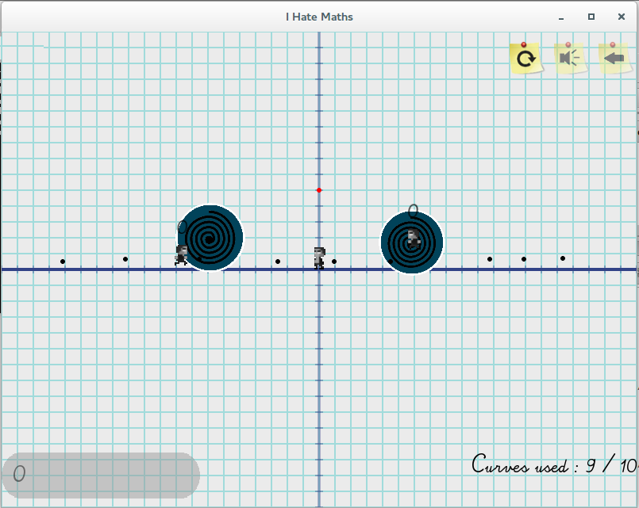
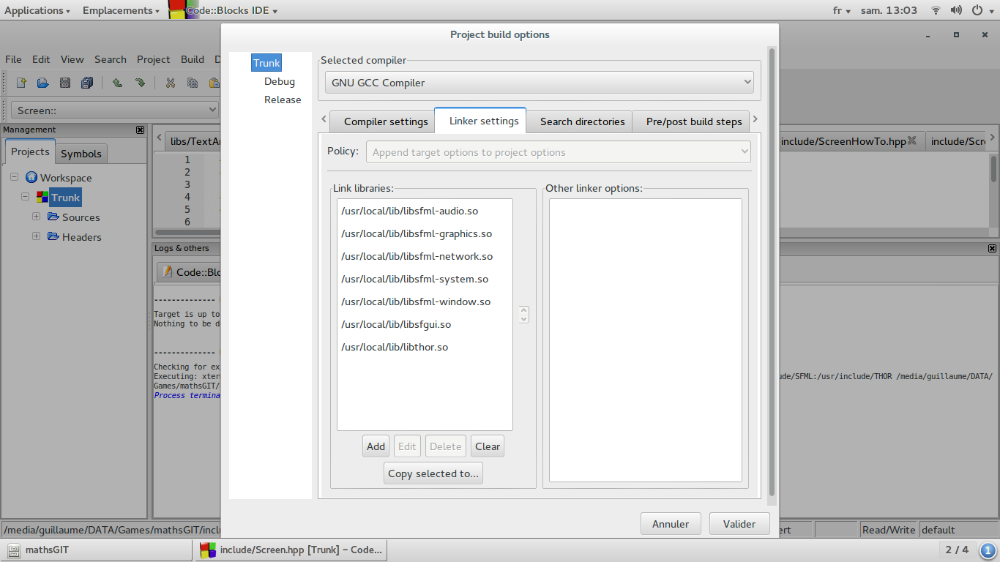
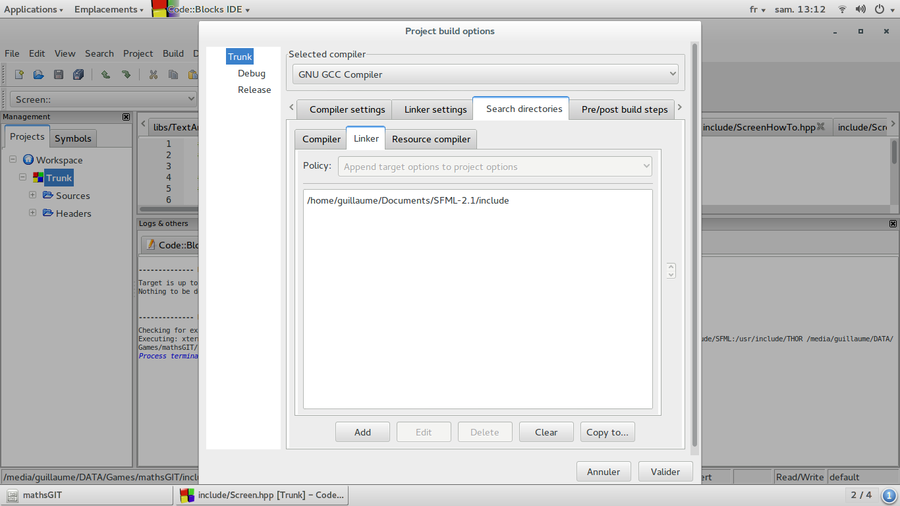

Math Game
===================

> **Le projet reste en cours de développement, certaine fonctionnalités peuvent dysfonctionner**


Idée
-------------
Le but de ce jeu était de faire un jeu de plate-forme en utilisant les courbes mathématiques comme élément central du jeu.






Comment jouer
-------------------
## touches
* se deplacer : *Fléches directionnelles*
* passer à la courbes suivantes: *P*
* passer à la courbes précédente: *M*

Modes de jeu
-------------------
Il existe deux mode de jeu:

- le premier est la version du jeu normale
- le second est le mode _hard_ (le nombre de changement de courbes est plus réduit)

Installation
-------------
**L'installation n'a été testée que sur Ubuntu 14.04 LTS pour le moment.**

* MathGame contient des librairies externes que vous devrez compiler par vous même pour faire fonctionner le jeu*

## SFML
> Les sources sont contenu dans le dossier _extlib_


```
cd MathGame/extlibs
unzip extlibs_sources.zip
cd SFML-2.1
```

avant d'aller plus loin il est nécessaire d'installer les dependances nécessaires à la compilation de SFML :

  - pthread   ( libpthread-workqueue-dev )
  - opengl    ( libgl1-mesa-dev )
  - xlib      ( libx11-dev )
  - xrandr    ( libxrandr-dev )
  - freetype  ( libfreetype6-dev )
  - glew      ( libglew-dev )
  - jpeg      ( libjpeg8-dev )
  - sndfile   ( libsndfile1-dev )
  - openal    ( libopenal-dev )

  `sudo apt-get update && sudo apt-get install libpthread-workqueue-dev libgl1-mesa-dev libx11-dev libxrandr-dev libfreetype6-dev libglew-dev libjpeg8-dev libsndfile1-dev libopenal-dev`

on va maintenant compiler SFML :

````
mkdir build && cd build
cmake ..
sudo make install
```

## Thor
> Les sources sont contenu dans le dossier _extlib_

Prendre les sources et configurer la compilation avec *cmake*
Si il ne trouve pas la SFML, n'oublier de définir la variable `SFML_INCLUDE_DIR=PathToSFML/include`

```
cd Thor
mkdir build && cd build
cmake ..
sudo make install
```

Plus de précisions:
[tutorial officiel de l'installation de Thor](http://www.bromeon.ch/libraries/thor/tutorials/v2.0/installation.html)

### SFGUI
Prendre les sources dans le repository (dans le dossier _extlibs_) et configurer la compilation avec *cmake*

 ```
cd MathGame/extlibs/SFGUI
mkdir build && cd build
cmake -D CMAKE_MODULE_PATH=/usr/local/share/SFML/cmake/Modules/ ..
sudo make install
```

[Site officiel de la librairie](http://sfgui.sfml-dev.de/)

**Après l'installation de ces libs => `sudo ldconfig`**

## Compiler Math Game
### Via code::blocks
il suffit de lancer le projet :




- allez dans _build options_ ( clic droit projet -> Build options... ), et ajoutez les fichiers des librairies externes
- libsfml-audio.so,
- libsfml-graphics.so,
- libsfml-system.so,
- libsfml-window.so,
- libsfgui.so,
- libthor.so

- Sous windows les extensions sont des `.a`
- Sur linux pas besoin d'inclure les headers qui lors de l'installation dans le dossier `usr/local/include` et/ou `usr/lib/include`
Sur windows, il faudra ajouter la référence ici




### Via un makefile
```
make all
./bin/Release/ProjetMath
```

Licence
------------
LGPL


